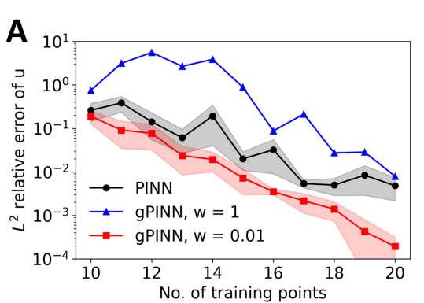
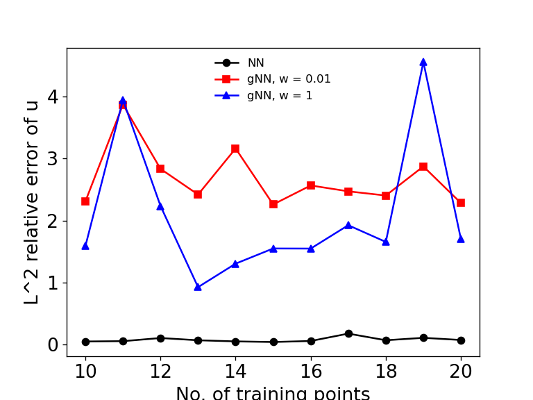
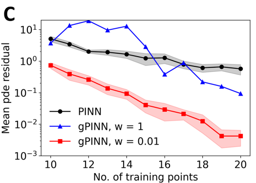
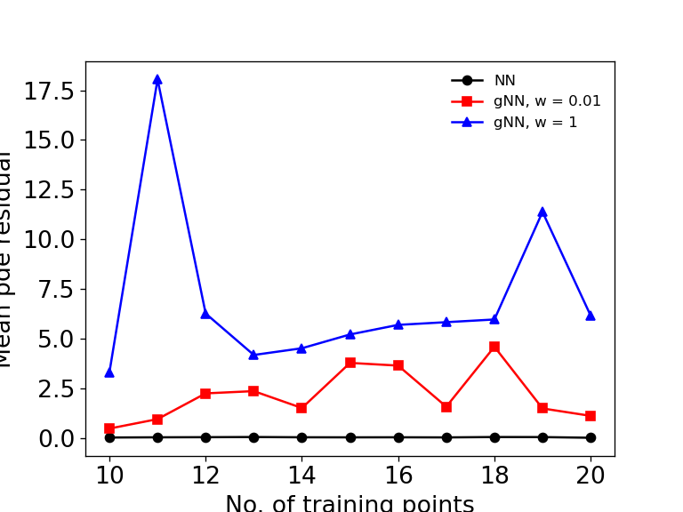
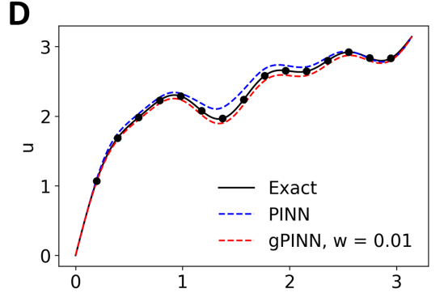
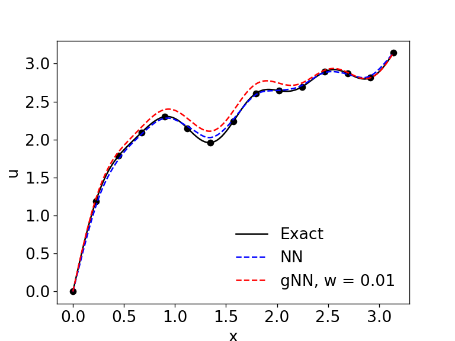
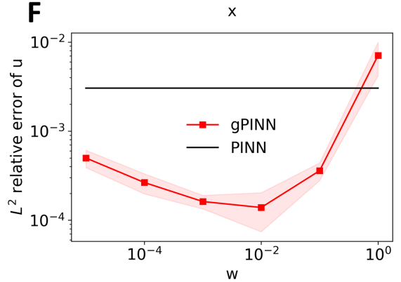
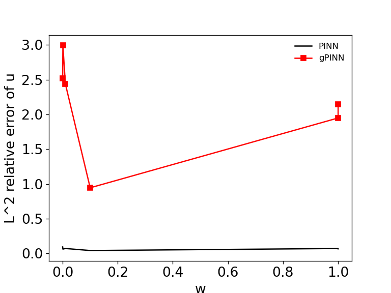

# Paddle 论文复现挑战赛（科学计算方向-51）

[比赛链接](https://aistudio.baidu.com/aistudio/competition/detail/406/0/introduction)

- #### 论文复现要求：

#### 参考资料：

1. [deepxde文档](https://deepxde.readthedocs.io/en/latest/index.html)
2. [PaddlePaddle框架API文档](https://www.paddlepaddle.org.cn/documentation/docs/zh/api/index_cn.html)
3. [PaddleScience](https://github.com/PaddlePaddle/PaddleScience)

## 1. 论文解读

### 原文：[gPINN: Gradient-enhanced physics-informed neural networks](https://www.sciencedirect.com/science/article/pii/S0045782522001438?via%3Dihub)

##### - gPINNs

## 2. 代码说明

### 官方源码：[gPINNs-DeepXDE](https://github.com/lu-group/gpinn)

- [AI Studio项目地址](https://aistudio.baidu.com/aistudio/projectdetail/4532062)(目前不考虑提交)

## 3. 复现情况

#### 复现过程中出现很多与论文差别很大的结果，目前在找出现差异的原因，大概率是计算模型写的不够好，需要进一步优化

### 1）3.2

- **3.2.1 Poisson 1d, Figure 2：**

|                          论文 Fig.2                          | 复现 Fig2                                                    |
| :----------------------------------------------------------: | ------------------------------------------------------------ |
|  |  |
|  |  |
|  |  |
|  |  |
|  |  |
|  |  |
|  |  |

- **出现的问题：**

  1. 误差反常：随着训练点的增加，训练误差显然应该是逐渐减小的，但是我的结果明显是错误的，只有原始的PINN稍微符合情况，而无论是W是0.01还是1， 都是不稳定的。
  2. PINNs训练效果优于gPINNs：按照作者的结论， gPINNs是显然要好于PINNs无论是误差还是预测，但是我的结果只有在预测`u'`时，gPINNs是优于PINNs

  **出现以上结果的原因，**1. 训练框架不够好 2. 误差计算出错

- **可能可行解决方式：** 1. 完善框架

### 2) 3.3

